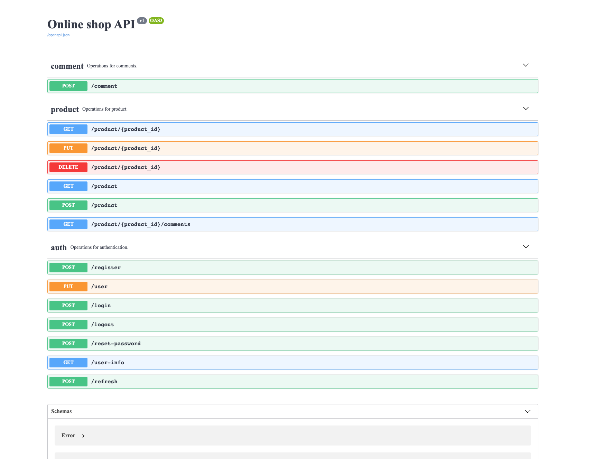
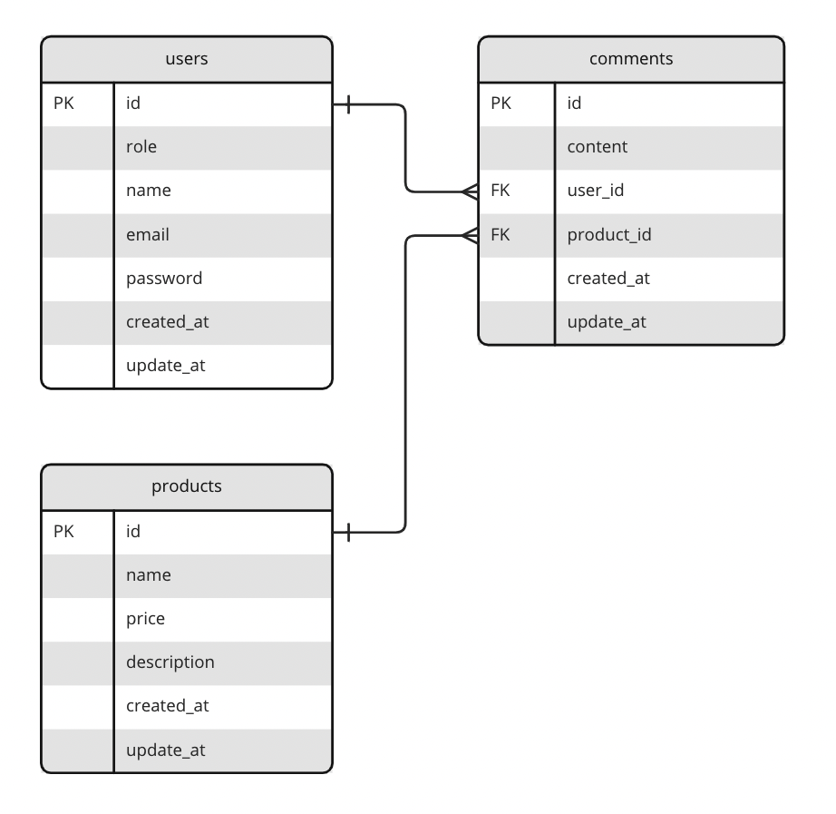

online-shop-api
===============
## About the project

A simple API app for online shop includes the following features:

- Provide authentication features (register, login, logout, reset the password, refresh token)
- Provide two different roles for the user (admin, user)
- Admin users can add/delete/update products of the store
- Users can update their information (name, email) and reset their password.
- Users can search for products with names and add a comment for the product.

### Installation

To run this project locally, it requires `python 3.10`, `pip` and `pipenv` pre-installed.

> Clone the project

```bash
git clone https://github.com/irenenguyen1017/online-shop-api.git
```

> Go to the project directory

```bash
cd online-shop-api
```

> Activate virtual environment

```bash
pipenv shell
```

> Install packages

```bash
pipenv install
```

> Add seed data

```bash
pipenv run seed:data
```

> Start app

```bash
pipenv run dev:start
```

> Head over to `http://localhost:3000`, where you can find the API documentations generated by [Swagger UI](https://github.com/swagger-api/swagger-ui)




## API Documentation

[Api documentation](docs/API_DOC.md)

### Running API locally

Some API requests are required `admin` access. When running the app locally you can use the following login credentials to quickly test the API.

> For admin access

```json
{ 
    "email": "admin@test.com",
    "password": "admin"
}
```

> For normal user access

```json
{ 
    "email": "user@test.com",
    "password": "user"
}
```

## Database and model architecture

### Database system

`sqlite3` is used to fasten local development as it doesn't require a server, and the `online-shop-api` app is small. For production deployment, it should be replaced by a different database system like PostgreSQL due to the following issues below:

- It hasn’t got network access
- It’s not suitable for large-scale apps
- It has a limited database size

### Entity relationship diagram (ERD)


### Models and schemas

There are 3 main schema models

- `User`: Contains details about the users. `User` model has one-to-many relationship with `Comment` model.

- `Product`: Contains details about the products. `Product` model has one-to-many relationship with `Comment` model.

- `Comment`: Contains details about the comments. `Comment` model has many-to-one relationship with `User` model and `Product` model.

## Third party libraries

- [**flask**](https://flask.palletsprojects.com/en/2.2.x/): The Python micro framework for building web applications.

- [**flask-sqlalchemy**](https://flask-sqlalchemy.palletsprojects.com/en/3.0.x/): Adds SQLAlchemy support to Flask.

- [**flask-smorest**](https://flask-smorest.readthedocs.io/en/latest/): A database-agnostic framework library for creating REST APIs.

- [**flask-cors**](https://flask-cors.readthedocs.io/en/latest/): A Flask extension for handling Cross Origin Resource Sharing (CORS).
  
- [**sqlalchemy-utils**](https://sqlalchemy-utils.readthedocs.io/en/latest/): A collection of custom data types and various utility functions for SQLAlchemy.

- [**marshmallow**](https://marshmallow.readthedocs.io/en/stable/): An ORM/ODM/framework-agnostic library for converting complex datatypes, such as objects, to and from native Python datatypes.

- [**flask-jwt-extended**](https://flask-jwt-extended.readthedocs.io/en/stable/): An open source Flask extension that provides JWT support.

- [**flask-bcrypt**](https://flask-bcrypt.readthedocs.io/en/1.0.1/): A Flask extension that provides bcrypt hashing utilities for your application.

- [**bleach**](https://bleach.readthedocs.io/en/latest/): An allowed-list-based HTML sanitizing library that escapes or strips markup and attributes.

- [**flask-seeder**](https://github.com/diddi-/flask-seeder): Flask extension for seeding database
